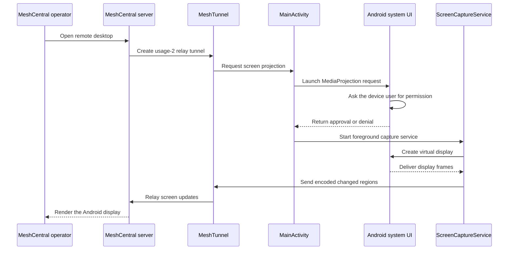

# Remote Desktop on Android

This document describes the remote desktop implementation in the MeshCentral
Android Agent and the restrictions that apply because the agent is an ordinary,
non-root Android application.

## Summary

Remote desktop is **screen sharing only** through the MediaProjection path: a
MeshCentral operator sees the device display but cannot control it. Enabling the
bundled accessibility service adds tap, long press, drag, scroll, and key input
for unattended control, within the limits described under Non-Root Limitations.

The agent uses Android's public
[MediaProjection API](https://developer.android.com/media/grow/media-projection)
to capture the display. Android owns the capture authorization dialog and the
user can deny or stop sharing at any time. The app runs capture in a foreground
service, so Android also shows an ongoing notification while projection is
active.

## Session Flow

The main implementation points are:

- `MeshTunnel.kt` handles MeshCentral relay tunnels. Usage `2` is remote
  desktop.
- `MainActivity.kt` launches Android's MediaProjection authorization flow.
- `ScreenCaptureService.kt` owns the active projection, virtual display, frame
  processing, and transmission.
- `AndroidManifest.xml` declares a foreground service with the
  `mediaProjection` service type.

## Capture and Encoding

After authorization, `ScreenCaptureService` creates a virtual display at the
device display size and attaches an `ImageReader` using RGBA pixels. For each
available frame, the service:

1. Acquires the latest image instead of processing every queued frame.
2. Optionally scales the image to the size requested by MeshCentral.
3. Divides the image into 64 by 64 pixel tiles.
4. Hashes each tile (FNV-1a over the pixels) and compares it with the previous
   frame.
5. Sends changed rectangular regions. If at least 85 percent of the tiles have
   changed, it sends the complete image instead.
6. Encodes regions as JPEG by default. PNG and WebP are also supported; TIFF is
   not supported by the Android implementation.

The server can request image type, compression quality, and scaling. A frame
rate value is parsed from the desktop settings message, but the current capture
code does not apply it as a time-based limiter. Actual update speed is therefore
determined by display activity, image processing cost, device performance, and
network throughput.

If an outgoing WebSocket queue grows beyond 65,535 bytes, the service skips
frames until the queue drains. This favors a current display over delivering
every intermediate frame. The same captured updates are sent to every active
remote desktop tunnel.

When the device rotates, the service releases and recreates the virtual display
after a short delay, then reports the new dimensions to connected viewers.

## Consent and Lifetime

MediaProjection is a user-authorized Android capability, not a normal runtime
permission. The agent cannot grant it to itself. Starting projection opens a
system-owned dialog, and capture starts only if the local device user approves
it.

The setting currently labeled **Automatic consent** does not provide privileged
or silent approval. Enabling it immediately asks Android to start projection.
Once the user approves, the agent keeps that projection service active when the
last viewer disconnects, allowing later viewers to reuse the active capture
session without another prompt. With the setting disabled, projection stops
when the final remote desktop tunnel closes.

Prompts also follow the server's consent flags: with automatic consent on, a
session whose policy sets the desktop or files prompt bit still asks the device
user, and a prompt expires after the server's consent timeout (30 seconds by
default) as a denial unless the server allows auto-accept on timeout.

Projection also stops when the user stops sharing through Android, the app asks
the service to stop, the agent is disconnected, the process is terminated, or
Android revokes the projection. A stopped or lost projection cannot be silently
restored; a new system authorization may be required. Newer Android releases
also impose tighter one-time MediaProjection token and foreground-service
rules, so deployments must not assume that an approval survives app or device
restarts.

## Non-Root Limitations

### Remote input requires the accessibility service

Android does not let an ordinary application inject touch or keyboard events into
other applications. On the plain MediaProjection screen share the MeshCentral
mouse, touch, and key messages are recognized by `MeshTunnel` but do nothing, so
that path is view-only.

When the device user explicitly enables the bundled `MeshAccessibilityService`
in Android settings, pointer input is streamed to the screen as accessibility
gestures. A button press puts a finger on the screen, mouse moves drag it, and
the release lifts it, so the device reacts as it would to a real touch:

| Viewer action | Device |
| --- | --- |
| Click | Tap |
| Press and hold | Long press (context menus, text selection) |
| Drag | Live drag: scrolling, moving icons after a long press; on the focused text field it selects text as a mouse would |
| Double-click | Double tap |
| Mouse wheel | Swipe up or down under the cursor |
| Right-click | Back |
| Middle-click | Home |

Keyboard input goes to the focused text field: characters, Backspace, Delete,
Enter, Tab, arrows with Shift to extend the selection, and Ctrl with A, C, X or
V. On Android 13+ this runs through the system input method, so fast typing is
kept in order; older releases rewrite the field's text and guard against a
keystroke arriving before the previous one was applied. The on-screen panel
buttons map to Android global actions
(Back, Home, Recents, notifications, quick settings, lock, power). The Apps
button uses the Android 14+ accessibility all-apps action when the launcher
honours it and otherwise goes Home and swipes up, which opens the app drawer on
stock and most vendor launchers.

This is not equivalent to root-level input: support varies by Android version
and device vendor, some screens reject accessibility gestures, multi-touch
gestures such as pinch are not available, `FLAG_SECURE` windows still capture
blank, and Android shows persistent privacy indicators. The service is opt-in
and must not be treated as a way to bypass user consent.

### Protected content may be blank

Applications can protect windows with `FLAG_SECURE`. Password managers,
streaming applications, banking applications, DRM video, work-profile policy,
and some system screens commonly use this protection. MediaProjection returns
blank or obscured content for protected surfaces. A non-root agent cannot
override this policy.

### The lock screen is only partly usable

The agent wakes the display when a session starts and for a minute after each
operator action, so a sleeping device shows its lock screen instead of a black
frame. The lock screen itself captures normally, but Android blanks the PIN and
password entry from screen capture, so the viewer goes black once it is opened.
Digits, Backspace and Enter typed on the operator's keyboard are pressed on the
keyguard's own buttons, which allows a blind unlock with a PIN or password;
pattern locks cannot be entered remotely. The agent cannot change lock-screen
security or keep the device unlocked against system policy.

### No silent background start

Android controls when an activity and a media-projection foreground service may
start from the background. The authorization dialog needs an activity that can
be shown to the user. Battery restrictions, background launch limits, process
termination, and vendor-specific power management can delay or prevent a remote
session from starting until the user opens the app.

The foreground notification is mandatory and cannot legitimately be hidden by
a non-root application. On supported Android versions, the system also presents
screen-sharing privacy indicators and controls.

### Capture is visual only

This implementation captures display pixels only. It does not capture device or
microphone audio as part of remote desktop, forward clipboard contents, expose
remote cursors on the device, or provide a remote shell. Any separate media,
file, or console capabilities use different MeshCentral channels and Android
permissions.

### Performance is device-dependent

Frames are copied to Android `Bitmap` objects, hashed tile by tile, compressed,
and sent over WebSockets. High-resolution displays, animation, video, frequent
rotation, low-end devices, thermal throttling, and slow networks can reduce the
update rate and increase CPU, memory, battery, and data usage. This is an image
update protocol rather than a hardware video stream, so it is intended for
inspection and support rather than smooth video playback.

## Capability Matrix

| Capability | Current behavior | Primary constraint |
| --- | --- | --- |
| View the display | Supported after local MediaProjection approval | Android user consent |
| Multiple viewers | Supported; frames are broadcast to active desktop tunnels | Device and network load |
| Rotation | Supported by recreating the virtual display | Brief update interruption |
| Quality and scaling | Supported | Server settings and device cost |
| Remote tap, long press, drag, or typing | Supported with the accessibility service enabled; otherwise a no-op | Requires user-enabled `MeshAccessibilityService` |
| Secure or DRM content | Not capturable | Android secure-surface policy |
| Silent capture after restart | Not supported | MediaProjection authorization and lifecycle rules |
| Hide sharing notification | Not supported | Foreground-service requirement |
| Unlock the lock screen | PIN or password typed blind; the entry screen captures black and pattern locks are not supported | Android keyguard security |
| Remote desktop audio | Not supported | Not implemented |

## Security Model

The remote desktop stream is sent through authenticated MeshCentral relay
tunnels over WebSockets. That transport does not change Android's local trust
model: pairing a device or granting a MeshCentral user remote-desktop rights
does not grant the app root, system-signature permissions, MediaProjection
approval, or input-injection privileges.

For operation and support, treat the local Android user as the final authority:

- The user must be able to recognize that sharing is active.
- A denial or system-initiated stop must be respected.
- Server permissions should restrict who can open remote desktop sessions.
- Operators should expect protected and policy-managed screens to be hidden.
- The feature should be described as **remote screen viewing**, not unattended
  full remote control.